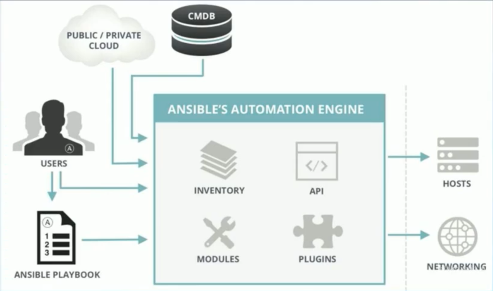

# Ansible



## 安装

直接安装就行

## 配置

ansible config文件，默认目录`/etc/ansible/ansible.cfg`.

host文件列表, 默认目录`/etc/ansible/hosts`, 用section可以支持分组,也就是ansible里面的inventory.

- 未分组主机默认会分配到一个all的section里面。
- 可以用section来分组机器,比如[master]表示master主机列表
- 可以用host[001:100].test.com来写法来表示100台主机

变量的使用。

- 机器变量，可以直接写到host后面
- 组变量，可以定义一个section比如[master:vars]，里面写变量信息. 还可以用yml的格式写到`/etc/ansible/group_vars/<文件名>.yml`


## 常用模块

- command, shell模块
  - command(default), 不支持重定向，管道这些
  - shell: `ansible -m shell -a ""`
- copy, file模块
  - copy: `-m copy -a 'src=<> dest=<>'`
  - file: `-m file -a 'dest=<> mode= owner= group= state='`
    - state: 默认创建文件，`directory`用来创建目录，`absent`用来删除文件或者目录。
- 管理软件包模块
  - `-m yum -a 'name=<package-name> state='`
    - state: `present`安装文件包, `latest`更新到最新, `absent`删除文件包
- 用户组模块
  - `-m user -a 'name=<username> state= password='`
- 管理服务模块
  - `-m service -a 'name=<servicename> state='`
- setup模块可以收集主机信息
  - `-m setup`

## Playbook

- YAML格式
- handlers, 在变更时执行操作。
  ```yaml
  ---
  - hosts: localhost
    gather_facts: no

    tasks:
    - name: task name
      copy: # Take copy module here as an example
        src:
        dest:
      notify: # Add nofity here so that handlers can know when it can be triggered
      - restart service # Define the name of notify

    handlers:
    - name: restart service # Use the same name of notify
      service: name=nginx state=reload # Define the action here
  ```
- 任务控制`tags`
  ```yaml
  ---
  - hosts: localhost
    gather_facts: no

    tasks:
    - name: task1
      tags: task1
    - name: task2
      tags: task2
  ```
  指定执行任务
  ```bash
  ansible-playbook <filename>.yml --tags 'task1'
  ```
  指定跳过任务
  ```bash
  ansible-playbook <filename>.yml --skip-tags 'task1'
  ```
- 文件调试
  - 语法检查 `--syntax-check`
  - 打印语句
    ```yaml
    ---
    - host: localhost
      tasks:
      - debug:
        msg: {{ group_names }}
      - debug:
        msg: {{ inventory_hostname }}
      - debug:
        msg: {{ ansible_hostname }}
    ```
- 变量定义和使用
  - 命令行 `ansible-playbook -e`
  - yaml文件里可以使用`vars`来定义变量
    ```yaml
    ---
    - hosts: localhost
      gather_facts: no
      vars:
      - var1: test
      - var2: test
      - var3: test
      tasks:
      - name: test var1
        debug: 
        msg: {{ var1 }}
      - name: test var2
        debug: msg="{{ var2 }}"
    ```
  - 注册变量
    ```yaml
    ---
    - hosts: localhost
      gather_facts: no
      
      tasks:
      - name: register the var
        shell: "whoami"               # dump the login user here 
        register: register_var

      - name: dump the var
        debug: msg="{{ register_var.stdout }}"
    ```
  - 系统信息变量
- playbook文件复用
  - include && import
    - include*: 运行时导入
      - `--list-tags`,`--list-tasks`不会显示到输出
      - 不能使用`notify`触发来自`include*`内处理程序的名字（handlers）
    - import*: 在playbook解析时导入
      - 不能和循环一起使用
      - 将变量用于目标文件时或角色名称时，不能使用inventory中的变量
  - import_playbook
    - `import_playbook: playbook.yml`
  - include_tasks && import_tasks
    - `import_tasks: task.yml`
- playbook流程控制
  - 条件
    - when
  - 循环
    - loop and items
- 模版（jinja2）
- roles
  - roles 目录结构
    - tasks: 包含角色要执行的主要任务列表
    - handles: 包含角色使用的处理程序
    - defaults: 角色默认的变量
    - vars: 角色其他的变量
    - files: 角色部署时用到的文件
    - templates: 角色部署时用到的模版
    - meta: 角色定义的一些元数据
  
  参考下面的目录结构：
    ```bash
    site.yaml
    webserver.yaml
    fooserver.yaml
    roles/
      |- common/
          |- files/
          |- templates/
          |- tasks/
          |- handles/
          |- vars/
          |- defaults/
          |- meta/
       |- webserver/
          |- files/
          |- templates/
          |- tasks/
          |- handles/
          |- vars/
          |- defaults/
    ```
  - roles 基本使用

```yaml
---
- hosts: all
  roles:
    - common
    - nginx
    - php
```

```yaml
---
- hosts: all
  roles:
  - common
  - role: nginx
    vars:
      var1: 'a'
      var2: 'b'
  - role: php
    vars:
      var1: 'c'
      var2: 'd'
```

```yaml
---
- hosts: all
  roles:
  - role: common
    tags: ['common']
  - role: nginx
    tags: ['nginx']
  - role: php
    tags: ['php']
```
