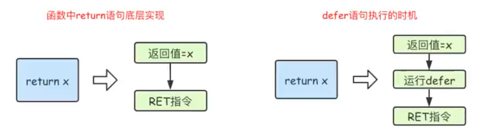
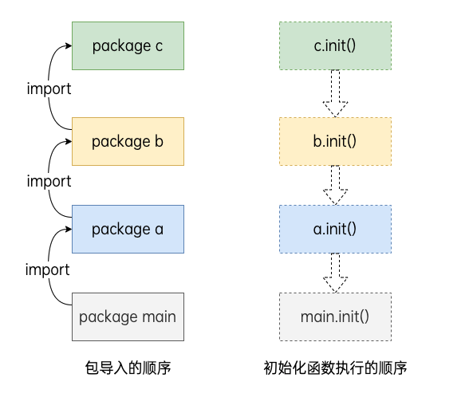

# go 语言学习笔记

## 标识符和关键字

golang里面的标识符由字母，数字和`_`组成，并且只能字母和`_`开头.

25个关键字
```
    break        default      func         interface    select
    case         defer        go           map          struct
    chan         else         goto         package      switch
    const        fallthrough  if           range        type
    continue     for          import       return       var

```

保留字
```
    Constants:    true  false  iota  nil

        Types:    int  int8  int16  int32  int64  
                  uint  uint8  uint16  uint32  uint64  uintptr
                  float32  float64  complex128  complex64
                  bool  byte  rune  string  error

    Functions:   make  len  cap  new  append  copy  close  delete
                 complex  real  imag
                 panic  recover

```

## 变量，常量 

### 变量声明

- 标准声明
  ```go
    var 变量名 变量类型
  ```

- 批量声明

```go
    var (
        变量名 变量类型
        变量名 变量类型
    )
```

### 变量初始化

```go
var 变量名 类型 = 表达式
var name, age = "Q1mi", 20
```

- 类型推导, 不用指定变量类型
```go
var name = "Q1mi"
var age = 18
```
- 短变量声明, 使用`:=`
```go
m := 200
```
- 匿名变量，使用`_`
```go
x, _ := foo()
```
匿名变量不占用命名空间，不会分配内存，所以匿名变量之间不存在重复声明

### 常量

```go
const (
    a = 1
)
```

### `iota`
`iota`是go语言的常量计数器，只能在常量的表达式中使用.

`iota`在const关键字出现时将被重置为0。const中每新增一行常量声明将使`iota`计数一次(iota可理解为const语句块中的行索引)。 使用iota能简化定义，在定义枚举时很有用

```go
const (
		n1 = iota //0
		n2        //1
		_
		n4        //3
	)
```
```go
const (
		n1 = iota //0
		n2 = 100  //100
		n3 = iota //2
		n4        //3
	)
	const n5 = iota //0
```
```go
const (
		_  = iota
		KB = 1 << (10 * iota)
		MB = 1 << (10 * iota)
		GB = 1 << (10 * iota)
		TB = 1 << (10 * iota)
		PB = 1 << (10 * iota)
	)
```

## 基本数据类型

```go
package main
 
import "fmt"
 
func main(){
	// 十进制
	var a int = 10
	fmt.Printf("%d \n", a)  // 10
	fmt.Printf("%b \n", a)  // 1010  占位符%b表示二进制
 
	// 八进制  以0开头
	var b int = 077
	fmt.Printf("%o \n", b)  // 77
 
	// 十六进制  以0x开头
	var c int = 0xff
	fmt.Printf("%x \n", c)  // ff
	fmt.Printf("%X \n", c)  // FF
}
```
### 字符串
Go 语言里的字符串的内部实现使用UTF-8编码。 字符串的值为双引号(")中的内容，可以在Go语言的源码中直接添加非ASCII码字符.

单引号('')用来表示的字符

多行字符串可以使用``
```go
s1 := `第一行
第二行
第三行
`
```

字符串的常用操作

- len(str) 求长度
- +或fmt.Sprintf 拼接字符串
- strings.Split	分割
- strings.contains	判断是否包含
- strings.HasPrefix,strings.HasSuffix	前缀/后缀判断
- strings.Index(),strings.LastIndex()	子串出现的位置
- strings.Join(a[]string, sep string)	join操作

### `byte`和`rune`

Go 语言的字符有以下两种：

uint8类型，或者叫 byte 型，代表一个ASCII码字符。
rune类型，代表一个 UTF-8字符。

### 修改字符串
要修改字符串，需要先将其转换成[]rune或[]byte，完成后再转换为string。无论哪种转换，都会重新分配内存，并复制字节数组。

```go
func changeString() {
	s1 := "big"
	// 强制类型转换
	byteS1 := []byte(s1)
	byteS1[0] = 'p'
	fmt.Println(string(byteS1))

	s2 := "白萝卜"
	runeS2 := []rune(s2)
	runeS2[0] = '红'
	fmt.Println(string(runeS2))
}
```

## 运算符

- 算数运算符
- 关系运算符
- 位运算符
- 赋值运算符

## 流程控制

### `if` `else`

### `for`

```go
for 初始语句;条件表达式;结束语句{
    循环体语句
}
```

### `for range`

Go语言中可以使用for range遍历数组、切片、字符串、map 及通道（channel）。 通过for range遍历的返回值有以下规律：

- 数组、切片、字符串返回索引和值。
- map返回键和值。
- 通道（channel）只返回通道内的值。

### `switch` `case`

```go
func switchDemo1() {
	finger := 3
	switch finger {
	case 1:
		fmt.Println("大拇指")
	case 2:
		fmt.Println("食指")
	case 3:
		fmt.Println("中指")
	case 4:
		fmt.Println("无名指")
	case 5:
		fmt.Println("小拇指")
	default:
		fmt.Println("无效的输入！")
	}
}
```
`fallthrough`语法可以执行满足条件的case的下一个case，是为了兼容C语言中的case设计的，用的很少,现在不建议使用。例如
```go
func switchDemo1() {
	finger := 3
	switch finger {
	case 1:
		fmt.Println("大拇指")
	case 2:
		fmt.Println("食指")
	case 3:
		fmt.Println("中指")
		fallthrough
	case 4:
		fmt.Println("无名指")
	case 5:
		fmt.Println("小拇指")
	default:
		fmt.Println("无效的输入！")
	}
}
```
输出会打印case3和case4

### `goto`

`goto`语句通过标签进行代码间的无条件跳转。`goto`语句可以在快速跳出循环、避免重复退出上有一定的帮助。Go语言中使用`goto`语句能简化一些代码的实现过程。 例如双层嵌套的for循环要退出时：

```go
func gotoDemo() {
	for i := 0; i < 10; i++ {
		for j := 0; j < 10; j++ {
			if j == 2 {
				// 设置退出标签
				goto breakTag
			}
			fmt.Printf("%v-%v\n", i, j)
		}
	}
	return
	// 标签
breakTag:
	fmt.Println("结束for循环")
}
```

### `break`

```go
func breakDemo1() {
BREAKDEMO1:
	for i := 0; i < 10; i++ {
		for j := 0; j < 10; j++ {
			if j == 2 {
				break BREAKDEMO1
			}
			fmt.Printf("%v-%v\n", i, j)
		}
	}
	fmt.Println("...")
}
```

### `continue`

```go
func continueDemo() {
forloop1:
	for i := 0; i < 5; i++ {
		// forloop2:
		for j := 0; j < 5; j++ {
			if i == 2 && j == 2 {
				continue forloop1
			}
			fmt.Printf("%v-%v\n", i, j)
		}
	}
}
```

## 复杂数据类型

### 数组Array

需要唯一指定长度和存放的类型，使用时可以修改数组成员，但数组的大小不可变化。
```go
// 方式一
// 定义一个数组
var a [3]int
// 数据的初始化
a = [3]{1,2,3}

// 方式二
// 数据初始化
a := [...]int{1,2,3,4,5,6,7}

// 方式三
// 数据初始化, 根据索引来初始化
a :=[5]int{0:1, 4:2}
```

### 多维数组

```go
var a [3][2]int

a = [3][2]int{
	[2]int{1,2},
	[2]int{1,2},
	[2]int{1,2},
}
```

数组是值类型，不是引用类型

## 切片Slice

切片是一个拥有**相同类型元素**的**可变长度**的序列，支持自动扩容，是一个引用类型，内部结构包括地址，长度，容量。一般用于快速的操作一块数据集合。

```go
// 切片的定义
var s1 []int
var s2 []string

// 初始化
s1 = []int{1,2,3}
s2 = []string{"a","b","c"}

// 长度和容量
fmt.Println(len(s1), cap(s2)))

// 切片是一个底层数组的引用类型

// 使用make来创建切片
s1=make([]int, 5, 10) // 创建一个长度是5，容量是10的切片
```

### 切片的append和copy

#### append方法
```go
s1 = []int{1, 2, 3}
s1 = append(s1, 4)

s2 = []int{6, 7, 8}
s1 = append(s1, s2...) // ...用来拆开slice, slice本身不能作为append的参数，需要使用...来拆开作为string append进去. 这个用的地方还挺多的。
```

**NOTE:** append扩容的时候，扩容后的长度为当前slice里面元素的数量，容量则会按照申请的时候按倍数增加。比如刚开始的slice的长度为3，容量为3，append一个元素进去后，slice的长度为4， 容量则为3*2=6，如果继续append但没有达到容量的限制，则长度增加，容量不变。如果超过了容量的限制，则容量增倍，变成12。不同的切片类型的扩容策略也有差别，可以参考 [growslice](https://go.dev/src/runtime/slice.go)

#### copy方法

切变是引用类型，所以使用赋值操作的时候，会指向同一个指针地址，改变原来的数据，赋值变量里的数据也会发生变化。copy相当是创建了一个新的内存地址，原来数据元素中的数据copy到了新的内存地址中，修改原来的数据元素不会对copy的变量有任何影响。

```go
sVar := []int{1, 2, 3}
dvar := make([]int, 3) // 这块需要使用make来创建一个有长度的切片，如果使用dVar := []int{}, 因为长度为0，所以无法copy
copy(dVar, sVar)
```

go语言中没有删除切片元素的方法，可以使用切片本身的特性来删除元素。

## 指针

- `&`取地址
- `*`根据地址取值


### `new`和`make`

`make`和`new`都是用来分配内存地址的，区别在于，`make`只用于slice， map和chan的内存创建，而且它返回的类型就是这三个类型本身，而不是他们的指针类型，因为这三种类型本来就是引用类型，所以也就没有必要返回他们的指针.

`make`函数是无可替代的，在初始化slice,map和chan的时候都需要使用`make`然后才能开始操作。

## map

go语言中提供的映射关系容器为`map`, 内部是用散列表hash实现的。是一种无序的，基于k-v的数据结构。

```go
// 初始化一个map
m1 = make(map[string]int, 10)
m1["a"] = 1

// map取值的时候，可以使用下面这种方式来判断是否某个key存在
value, ok := m1["a"]
if ok {
	// 这里ok为true
	fmt.Println(value)
}

value, ok := m1["b"]
if ok {
	// 这里ok为false
	fmt.Println(value)
}

// 删除操作
delete(m1, key)
```

## 函数

```go
func 函数名(参数)(返回值类型) {
	函数体
}
```

`defer`语句会将其后面的跟随语句进行延迟处理，在`defer`归属的函数即将返回时，将延迟处理语句按照`defer`定义的**逆序**进行执行。多用于函数结束前释放资源(文件句柄，链接之类的)



### 高阶函数
函数本身也是一种类型，可以作为其他函数的变量，也可以作为其他函数的返回值。

### 匿名函数
没有名字的函数

### 闭包
指一个函数和与其相关的引用环境组合而成的实体。 简单的说就是`闭包=函数+引用环境`

### `panic`和`recover`

- recover()必须搭配defer使用
- defer一定要在可能引发panic的语句之前定义

### 递归
递归要有一个明确的退出条件


## 结构体
go语言中没有类的概念，也不支持类的继承等面向对象的概念，go语言中通过结构体的内嵌再配合接口比面向对象具有更高的的扩展性和灵活性。

### 类型别名和自定义类型

自定义类型
```go
type <T类型> <T类型>
```

类型别名
```go
type <T类型>=<T类型>
```

### 结构体

结构体是一种自定义数据类型，可以封装多个基本数据类型.
```go
type <T类型名> struct {
	<字段名> <T字段类型>
	<字段名> <T字段类型>
}
```

- 类型名：标识自定义结构体的名称，在同一个包里面不能重复
- 字段名：表示结构体字段名称，结构体中的字段名称要唯一
- 字段类型：表示字段的具体类型

### 匿名结构体
```go
func main() {
	var a struct{key string, value string}
	a.key = ""
	a.value = ""
}
```

### 结构体内存空间
结构体占用一块连续的内存地址， 空结构体不占用内存空间。

### 构造函数
因为`struct`是值类型，如果结构体比较复杂的话，值拷贝性能开销会比较大，所以该构造函数返回的是结构体指针类型。
```go
func newPerson(name, city string, age int8) *person {
	return &person{
		name: name,
		city: city,
		age:  age,
	}
}

p9 := newPerson("a", "b", 90)
fmt.Printf("%#v\n", p9) //&main.person{name:"a", city:"b", age:90}
```

- 约定成俗，构造函数都是以new开头的
- 当结构体内比较大的时候，尽量让构造函数返回指针来介绍内存的开销

### 方法

是一种作用于特殊类型变量的函数。

方法的定义
```go
func (接受者变量 接受者类型)方法名(参数变量 参数类型) (返回类型) {
	函数题
}
```

### 结构体的匿名字段

结构体允许起成员字段没有名字的字段名而只有类型，这种没有名字的字段被称为匿名字段;匿名字段默认采用类型作为字段名，因为结构体中的字段名要求唯一，所以对于匿名字段而言，类型得唯一
```go
type <name> struct {
	string
	int
}

func main() {
	p := <name>{
		"a",
		1,
	}
	fmt.Printf(p.string, p.int) //这里可以看到需要用类型获取值
}
```

NOTE: 感觉好像没啥用

### 结构体和JSON

```go

type Project struct {
	Key string `json:"key"`
	Value string `json:"value"`
}

type BodyInfo struct {
	Weight float64 `json:weight`
	Height float64 `json:height`
}

type <name> struct {
	Name      string  `json:"name"`
	ProductID int64   `json:"-"` // 表示不进行序列化.
	Number    int     `json:"number,string"` //表示序列化后转换成string类型.
	Price     float64 `json:"price,omitempty"` //omitempty表示在序列化的时候忽略0值或者空值, omitempty”前一定指定一个字段名.
	IsOnSale  bool    `json:"is_on_sale,string"`
	*BodyInfo `json:"bodyinfo,omitempty"` //若要在被嵌套结构体整体为空时使其在序列化结果中被忽略，不仅要在被嵌套结构体字段后加上json:"fileName,omitempty"，还要将其改为结构体指针
	Project   `json:"project"`   // `json:",inline"` 通常作用于内嵌的结构体类型
}
```

需要了解一下一个库`encoding/json`里面主要的序列化和反序列话的方法。

- 序列化就是把一个结构体转化成一个string/byte， 参考json.Marshal
- 反序列化就是把一个string/byte转化成结构体，参考json.Unmarshal

## 接口

在编程中会遇到以下场景：
- 不关心传递的参数类型，只关心调用的方法

```go
type <name> interface{
	test()
}

type a struct{}

type b struct {}

func (a a)test() {}

func (b b)test() {}
```

### 空接口

空接口是指没有定义任何方法的接口。

空接口可以存储任意类型的值，可以使用断言来获取存储的值的具体数据。

```go
v, ok := x.(T)
```
其中：
- x:表示类型为interface{}的变量
- T:表示断言x可能的值
- v, ok为返回值，其中，v为x转化成T以后的变量，ok是布尔值，为true表示断言成功。

多种类型的断言
```go
switch x.(type) {
	case string:
		fmt.Println("this is the string")
	case int:
		fmt.Println("this is the int")
	case bool:
		fmt.Println("this is the bool")
	default:
		fmt.Println("unknown the type")
}
```

## 包

- 一个文件夹下只能有一个包，同样的一个包不能在多个文件夹下。
- 包的名字可以不和文件夹名字一样。
- 包名为main的为应用程序的入口，如果项目没有main包，编译后不会生成可执行文件。

### 匿名导入包

只希望导入包，而不使用包里面的数据，只执行包里面的`init()`方法。可以使用匿名导入包。

```go
import _ "github.com/xxx"
```
### init()初始化函数

导入包的时候会自动触发内部的init()函数调用，init()函数**没有参数也没有返回值**，在程序运行时候自动被调用，不能在代码中主动调用它。

一个包的初始化过程是按照代码中引入的顺序来进行的，所有在该包中声明的init函数都将被串行调用并且仅调用执行一次。每一个包初始化的时候都是先执行依赖的包中声明的init函数再执行当前包中声明的init函数。确保在程序的main函数开始执行时所有的依赖包都已初始化完成。



## 文件操作

### 文件的读取
#### 用`os`包里面的`Read`来读取文件
```go
import os

func main() {
	// os.Open用来打开文件
	file, err := os.Open("./file")
	if err != nil {
		os.Exit(1)
	}
	
	defer file.Close()

	var (
		text make([]byte, 128)
		content []byte
	)

    // 循环读取文件
	for {
        n, err := file.Read(text)
    	if err != nil {
            if err == io.EOF {
        		return
        	}
    		fmt.Printf("failed to open the file due to %v\n", err)
    		os.Exit(1)
    	}
		content.append(content,tmp[:]...)
	}
}
```
#### 使用`bufio`读取文件
```go
import os

func main() {
	// os.Open用来打开文件
	file, err := os.Open("./file")
	if err != nil {
		os.Exit(1)
	}
	
	defer file.Close()

	reader := bufio.NewReader(file)

    // 循环读取文件
	for {
        line, err := reader.ReadString('\n')
		if err == io.EOG {
			return
		}
		if err != nil {
			os.Exit(1)
		}
		fmt.Printf("%v", line)
	}
}
```
#### 使用`ioutils.Readfile`读取文件
```go
import "io/ioutil"

func main() {
	context, err := ioutil.ReadFile("./file")
	if err != nil {
		return
	}
	fmt.Print(string(context))
}
```

### 文件的写入

#### `os.OpenFile()`函数可以以指定的模式打开文件

```go
func OpenFile(name string, flag int, perm FileMode) (*File, error) {

}
```
- name:文件名
- flag:以下这些类型

| 模式        | 含义 |
| ----------- | ---- |
| os.O_WRONLY | 只写 |
| os.O_CREATE | 创建 |
| os.O_RDONLY | 只读 |
| os.O_RDWR   | 读写 |
| os.O_TRUNC  | 清空 |
| os.O_APPEND | 追加 |
- perm:文件权限,r(04),w(02),x(01)

#### `Write`和`WriteString`
```go
func main() {
	file, err := os.OpenFile("./file.txt", os.O_CREATE|os.O_WRONLY, 0666)
	if err != nil {
		return
	}
	defer file.Close()
	str := "test"
	file.Write([]byte(str))
	file.WriteString(str)
}
```
#### `bufio.NewWrite`
```go
func main() {
	file, err := os.OpenFile("./file.txt", os.O_CREATE|os.O_WRONLY, 0666)
	if err != nil {
		return
	}
	defer file.Close()

	writer := bufio.NewWrite(file)
	writer.WriteString("text\n") // 将数据显写入缓存
	writer.Flush // 将缓存内容写入文件
}
```
#### `ioutil.WriteFile`
```go
func main() {
	str := "test"
	if err := ioutil.WriteFile("./file.txt", []byte(str), 0666); err != nil {
		return
	}
}
```