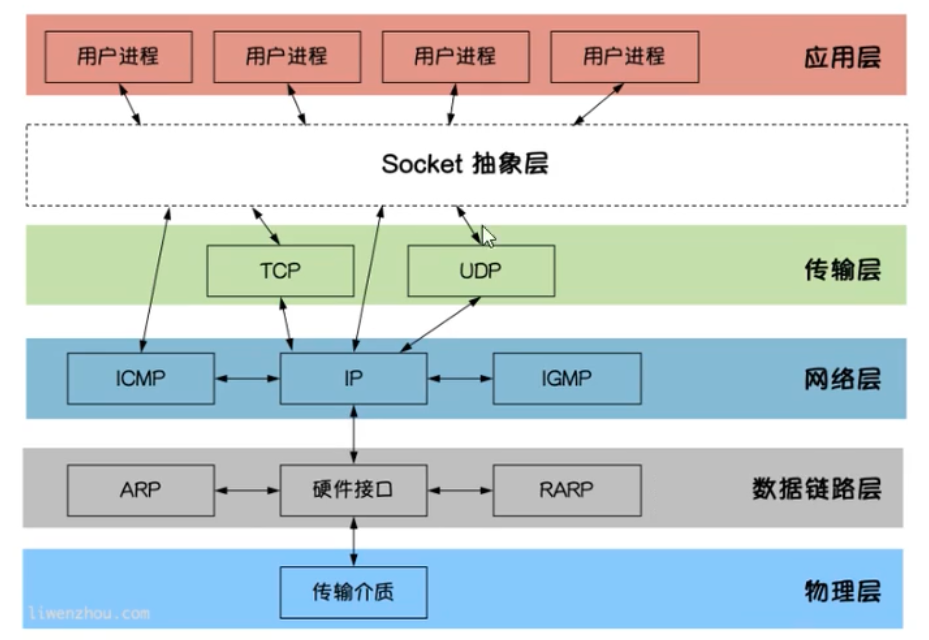

# 网络编程与Context

## 网络编程



### TCP通信

#### Server
1. 监听端口
2. 接受客户端请求建立链接
3. 创建goroutine处理链接

参考 [TCP server](./socket/tcp/server/main.go)

#### Client
1. 建立连接
2. 发送请求
参考 [TCP client](./socket/tcp/client/main.go)

### TCP黏包

为什么会出现黏包：
主要原因是tcp数据传递模式是流模式，在保持长连接的时候可以进行多次的收和发

黏包可发生在发送端也可以发生在接收端
1. 由Nagle算法造成的发送端的黏包： Nagle算法是一种改善网络传输效率的算法。简单的说就是当我们提交一段数据给TCP发送的时候，TCP并不是立即发送改数据，而是等待一小段时间看看在等待期间是否有其他要发送的数据，则一次吧几段数据都发送出去。
2. 接收端接受不及时造成的接收端黏包：TCP会吧接受到的数据存在自己的缓冲区中，然后通知应用层取数据。当应用层由于某些原因不能及时吧TCP的数据取出来的时候，就会造成TCP缓冲区中存放的了几段数据。

解决办法：
出现粘包的关键在于接收方不确定将要传输的数据包的大小，因此可以通过对数据包进行封包和拆包的操作来解决这个问题。

封包： 就是给数据加一段包头，这样一来数据包就分为包头和包体两部分内容了（过滤非法包的时候封包会加入"包尾"内容）。包头部分的长度是固定的，并且它存储了包体的长度，根据包头的长度固定以及包头中含有包体长度的变量就能正确的拆分出一个完整的包。

参考 [TCP黏包处理](./socket/tcp/pkg/propo.go)

### UDP 通信

UDP（User Datagram Protocol）用户数据报协议，是OSI模型下的无链接传输协议，不需要建立链接就能直接进行数据发送和接受，是不可靠的，没有时序的通信。

#### Server
参考 [UDP server](./socket/udp/server/main.go)

#### Client
参考 [UDP client](./socket/udp/client/main.go)

## Context

用来简化对于处理单个请求的多个`goroutine`之间与请求域的数据，取消信号，截止时间等相关操作，这些操作可能设计多个API调用。

- `context.WithCancel`
- `context.WithDeadline` 绝对时间

```go
d := time.Now().Add(2000 * time.Millisecond)
ctx, cancel := context.WithDeadline(context.Background(), d)

// ctx自身会过期，但在任何时候调用它的cancel函数都是很好的实践，如果不这么做，可能会
// 使上下文和父类存活的时间超过必要的时间。

defer cancel()

select {
case <-time.After(1 * time.Second):
	fmt.Println("test")
case <-ctx.Done():
	fmt.Println(ctx.Err())
}
```

- `context.WithTimeout`相对时间

```go
var wg sync.WaitGroup

func worker(ctx context.Context) {
LOOP:
	for {
		fmt.Println("in worker function")
		time.Sleep(time.Second)
		select {
		case <-ctx.Done():
			break LOOP
		default:
		}
	}
	fmt.Println("worker done")
	wg.Done()
}

func main() {
	ctx, cancel := context.WithTimeout(context.Background(), time.Millisecond*500)
	wg.Add(1)
	go worker(ctx)
	time.Sleep(time.Second)
	cancel()
	wg.Wait()
	fmt.Println("over")
}
```

- `context.WithValue`,能够将请求作用域的数据和`Context`对象建立关系.

`Context`是一个接口，其定义了四个需要实现的方法:

```go
type Context interface() {
    Deadline() (deadline time.Time, ok bool)
    Done() <- chan struct{}
    Err() error
    Value(key interface{}) interface{}
}
```

### `Background()`和`TODO()`

`Backgroud()`主要用于`main()`函数、初始化以及测试代码中，作为`Context`这个数结构的最顶层的`Context`,也就是根`Context`. 是上下文的默认值，所有其他的上下文都应该从它衍生出来.

`TODO()` 应该仅在不确定应该使用哪种上下文时使用.
