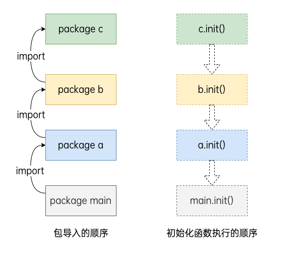

# 结构体与接口

## 结构体
go语言中没有类的概念，也不支持类的继承等面向对象的概念，go语言中通过结构体的内嵌再配合接口比面向对象具有更高的的扩展性和灵活性。

### 类型别名和自定义类型

自定义类型
```go
type <T类型> <T类型>
```

类型别名
```go
type <T类型>=<T类型>
```

### 结构体

结构体是一种自定义数据类型，可以封装多个基本数据类型.
```go
type <T类型名> struct {
	<字段名> <T字段类型>
	<字段名> <T字段类型>
}
```

- 类型名：标识自定义结构体的名称，在同一个包里面不能重复
- 字段名：表示结构体字段名称，结构体中的字段名称要唯一
- 字段类型：表示字段的具体类型

### 匿名结构体
```go
func main() {
	var a struct{key string, value string}
	a.key = ""
	a.value = ""
}
```

### 结构体内存空间
结构体占用一块连续的内存地址， 空结构体不占用内存空间。

### 构造函数
因为`struct`是值类型，如果结构体比较复杂的话，值拷贝性能开销会比较大，所以该构造函数返回的是结构体指针类型。
```go
func newPerson(name, city string, age int8) *person {
	return &person{
		name: name,
		city: city,
		age:  age,
	}
}

p9 := newPerson("a", "b", 90)
fmt.Printf("%#v\n", p9) //&main.person{name:"a", city:"b", age:90}
```

- 约定成俗，构造函数都是以new开头的
- 当结构体内比较大的时候，尽量让构造函数返回指针来介绍内存的开销

### 方法

是一种作用于特殊类型变量的函数。

方法的定义
```go
func (接受者变量 接受者类型)方法名(参数变量 参数类型) (返回类型) {
	函数题
}
```

### 结构体的匿名字段

结构体允许起成员字段没有名字的字段名而只有类型，这种没有名字的字段被称为匿名字段;匿名字段默认采用类型作为字段名，因为结构体中的字段名要求唯一，所以对于匿名字段而言，类型得唯一
```go
type <name> struct {
	string
	int
}

func main() {
	p := <name>{
		"a",
		1,
	}
	fmt.Printf(p.string, p.int) //这里可以看到需要用类型获取值
}
```

NOTE: 感觉好像没啥用

### 结构体和JSON

```go

type Project struct {
	Key string `json:"key"`
	Value string `json:"value"`
}

type BodyInfo struct {
	Weight float64 `json:weight`
	Height float64 `json:height`
}

type <name> struct {
	Name      string  `json:"name"`
	ProductID int64   `json:"-"` // 表示不进行序列化.
	Number    int     `json:"number,string"` //表示序列化后转换成string类型.
	Price     float64 `json:"price,omitempty"` //omitempty表示在序列化的时候忽略0值或者空值, omitempty"前一定指定一个字段名.
	IsOnSale  bool    `json:"is_on_sale,string"`
	*BodyInfo `json:"bodyinfo,omitempty"` //若要在被嵌套结构体整体为空时使其在序列化结果中被忽略，不仅要在被嵌套结构体字段后加上json:"fileName,omitempty"，还要将其改为结构体指针
	Project   `json:"project"`   // `json:",inline"` 通常作用于内嵌的结构体类型
}
```

需要了解一下一个库`encoding/json`里面主要的序列化和反序列话的方法。

- 序列化就是把一个结构体转化成一个string/byte， 参考json.Marshal
- 反序列化就是把一个string/byte转化成结构体，参考json.Unmarshal

## 接口

在编程中会遇到以下场景：
- 不关心传递的参数类型，只关心调用的方法

```go
type <name> interface{
	test()
}

type a struct{}

type b struct {}

func (a a)test() {}

func (b b)test() {}
```

### 空接口

空接口是指没有定义任何方法的接口。

空接口可以存储任意类型的值，可以使用断言来获取存储的值的具体数据。

```go
v, ok := x.(T)
```
其中：
- x:表示类型为interface{}的变量
- T:表示断言x可能的值
- v, ok为返回值，其中，v为x转化成T以后的变量，ok是布尔值，为true表示断言成功。

多种类型的断言
```go
switch x.(type) {
	case string:
		fmt.Println("this is the string")
	case int:
		fmt.Println("this is the int")
	case bool:
		fmt.Println("this is the bool")
	default:
		fmt.Println("unknown the type")
}
```

## 包

- 一个文件夹下只能有一个包，同样的一个包不能在多个文件夹下。
- 包的名字可以不和文件夹名字一样。
- 包名为main的为应用程序的入口，如果项目没有main包，编译后不会生成可执行文件。

### 匿名导入包

只希望导入包，而不使用包里面的数据，只执行包里面的`init()`方法。可以使用匿名导入包。

```go
import _ "github.com/xxx"
```
### init()初始化函数

导入包的时候会自动触发内部的init()函数调用，init()函数**没有参数也没有返回值**，在程序运行时候自动被调用，不能在代码中主动调用它。

一个包的初始化过程是按照代码中引入的顺序来进行的，所有在该包中声明的init函数都将被串行调用并且仅调用执行一次。每一个包初始化的时候都是先执行依赖的包中声明的init函数再执行当前包中声明的init函数。确保在程序的main函数开始执行时所有的依赖包都已初始化完成。


