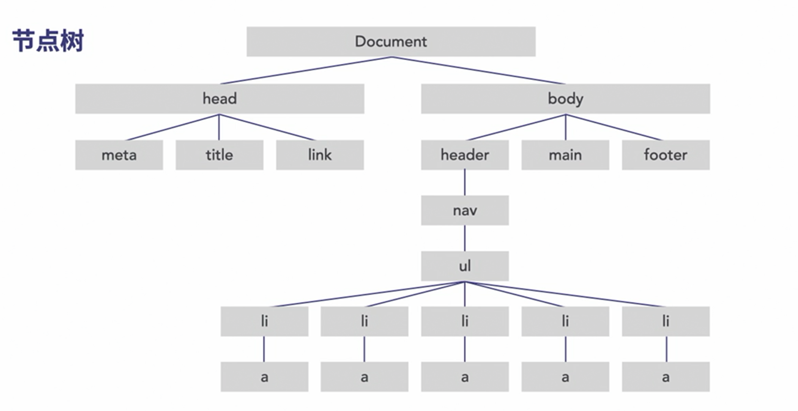

# JavaScript基础培训

## 基础知识

### javascript加载方式

- 立即加载
    
    `<script src="script.js"></script>`
    
    会有javascript渲染阻止
    
    

- 异步加载

    `<script src="script.js" async></script>`

    只会在javascript执行是有渲染阻止

    

- 延迟加载

    `<script src="script.js" defer></script>`
    
    

### 编码规则

- 大小写区分
- 命名约定，驼峰命名（camel Case）
  - 变量小写开头
  - 对象和类用大写开头
  - 常量全部大写
  - 每条语句末尾加分号`；`
  - 充分使用注释

## 数据处理

### 变量

- var 
- let 块级别本地变量，比var的变量作用域更小

### 数据类型

- number
- string
- bool
- null
- undefined
- symbol

### 运算符

- `+` `-` `*` `/`

### 条件语句

- `if`

```javascript
if (condition) {

} else {

}

```

### 数组

```javascript
new Array()
```

一些常用方法:
- `.length()`
- `.reverse()`
- `.shift()`
- `.unshift()`
- `.pop()`
- `.push()`
- `.splice()`
- `.slice()`
- `.indexOf()`
- `.join()`

## 函数和对象

### 三种类型的函数

- 具名函数：调用函数名称时执行
- 匿名函数：特定事件触发后运行
- 立即调用的函数表达式：在浏览器访问时立即运行

```javascript
// 实名函数，通过函数名称显式调用
function multiply() {
    var result = 3 * 4;
    console.log("the result is: ", result);
}
multiply();
```
```javascript
// 匿名函数保存在变量中
// 将变量作为函数调用
var divided = function() {
    var result = 3 / 4;
    console.log("the result is: ", result);
}
divided();
```
```javascript
// 立即调用的函数表达式
// 浏览器加载后立即运行
(function() {
    var result = 12 / 0.75;
    console.log("the result is: ", result);
}())
```

参数和返回值

```javascript
// 参数和返回值
function sum(a, b){
    var result = a + b;
    console.log("the result is: ", result);
    return result;
}

var total = sum(3, 4)
console.log("the total is: ", total);

```

### 构建基本函数

```javascript
function findBiggestFraction() {
    console.log("xxx");
}

findBiggestFraction();
```
### 参数传递
```javascript
function findBiggestFraction(a, b) {
    a > b ? console.log("the biggest fraction is: ", a):console.log("the biggest fraction is: ", b)
}

var firstFraction = 'a';
var secondFraction = 'b';
findBiggestFraction(firstFraction, secondFraction);
```
### 函数返回值
```javascript
function findBiggestFraction(a, b) {
    var result
    a > b ? result = a : result = b;
    return result
}

var firstFraction = 'a';
var secondFraction = 'b';
var result = findBiggestFraction(firstFraction, secondFraction);
console.log('The result is:', result)
```
### 匿名函数

```javascript
var theBiggest = function(a,b) {
    var result;
    a > b ? result = a : result = b;
    return result;
}

console.log(theBiggest(number1, number2));
```

### 立即调用的函数表达式
```javascript
var theBiggest = function(a,b) {
    var result;
    a > b ? result = a : result = b;
    return result;
}

console.log(theBiggest);
```
上面这个匿名函数在console中的输出会是function这个函数，不会执行。

如果想立即执行函数，可以使用()，例如：
```javascript
var theBiggest = (function(a,b)) {
    var result;
    a > b ? result = a : result = b;
    return result;
}(number1, number2)

console.log(theBiggest);
```
按照上面的方式，theBiggest就会得到函数的返回值。

### 变量作用域

- 全局作用域
- 局部作用域

### let和const

### 对象
```javascript
var test = new Object();
test.title = 'test';
test.name = 'hchen';

console.log('The object of test is:', test);

```
或者
```javascript
var test = {
    title: 'test',
    name: 'hchen'
}

console.log('The object of test is:', test);
```

### 对象构造函数

函数首字母大写来表示对象

```javascript
function Course(title, instructor, level, published, views) {
    this.title = title
    this.instructor = instructor
    this.level = level
    this.published = published
    this.views = views
    this.updateViews = function() {
        return ++this.views
    }
}

var course01 = new Course("test1", "hchenxa", 1, true, 0)
console.log(course01)

var course02 = new Course("test2", "hchenxa", 1, true, 5)
console.log(course02)

var courses= [
    new new Course("test1", "hchenxa", 1, true, 0),
    new Course("test2", "hchenxa", 1, true, 5)
]

console.log(courses)
console.log(courses[1].title)
courses[1].updateViews()
console.log(courses[1].views)
```

### 点和括号的表示法

括号可以用来处理特殊字符，比如`course["test:var"]`, 这种是句点处理不了的。

### 闭包

内部函数依赖于外部函数的变量来工作。

```javascript
function giveMeEms(pixels) {
    var baseValue = 16;
    function doTheMath() {
        return pixels/baseValue;
    }
    return doTheMath;
}

var s = giveMeEms(12);
var m = giveMeEms(18);
var l = giveMeEms(24);
var xl = giveMeems(32);

console.log("s: ", s());
console.log("m: ", m());
console.log("l: ", l());
console.log("xl: ", xl());

```

## Javascript和DOM

### DOM: 文档对象模型

- BOM 浏览器对象模型
  - window: window对象是浏览器对象模型中的顶级对象,包括了大量的属性和方法可以和浏览器本身和显示的对象进行交互.
  - 浏览器对象主要表示浏览器的功能和行为,所以,其中的大部分功能用的会比较少.
- DOM 文档对象模型
  - Document是window对象的一个属性,通过调用window.document来获取文档对象.
  - javascript通常在窗口内部,那同样也在window对象内部.
  - 文档对象模型是构成当前web页面的文档模型.

```html
<!DOCTYPE html>
<html lang="en-US">
    <head>
        <meta charset="UTF-8">
        <title>hchen test</title>
    </head>
<body>
    <h1>Hello World!</h1>
```

简单说说上面的html:
- 在HTML中,每一个内容都包裹在一个开始和结束标签中,HTML通过这些标签来创建HTML元素.
- 每一个元素都是一个DOM节点,浏览器使用处理对象的方法来对节点进行处理.

在应用CSS规则时，比如下面：
```css
a {
    color: white;
    display: block;
    text-decoration: none;
}
```
```html
<nav class="menu multi-level-nav">
    <ul>
        <li><a href="#">Home</a></li>
        <li><a href="#">About</a></li>
        <li><a href="#">Contact</a></li>
        <li><a href="#">Reservations</a></li>
    </ul>
</nav>
```
在把文档加载到浏览器时，他会加载到浏览器对象模型中的文档对象，并对这个文档实例创建一个DOM, 浏览器会创建一个节点树，对不同节点的关系进行建模。

在标准的HTML文档中，有一个包含了两个节点的HTML对象head和body,head节点包含了所有的不可见节点，例如标题，链接，元数据和脚本等等；body节点包含了所有的可见节点，这些节点在HTML里面的嵌套方式有着严格的层次关系。


### 使用querySelector方法定位DOM中的目标元素

文档是个巨大的对象，文档中的所有元素都是这个对象的节点。

可以使用标准的句点表示法来获取元素中的信息，例如：

```javascript
document.body; // 可以获取body 元素
document.title; // 可以获取文档标题
document.URL; // 可以获取URL
```

同时document也提供了很多方法可以使用来获取一些信息，例如:

```javascript
document.getElementById("some-ID"); // 通过ID获取元素
document.getElementsByClassName("classname"); // 可以通过类名获取所有元素的数组
document.getElementsByTagName("HTML tag"); // 可以通过HTML标签获取所有元素的数组
```

如果是要查询多级节点下面的节点时，这些方法就显得有些难用。

document里面提供了两个新的方法，基本可以满足绝大部分查询的需要，使用起来也更加高效。

```javascript
// 获取匹配选择器的第一个元素
document.querySelector(".main-nav a")

// 获取匹配选择器的所有元素的数组
document.querySelectorAll(".post-content p")

// 搜索时匹配多条件，可以用逗号隔开
document.querySelectorAll(".menu li a, .social-nav li a")
```

**NOTE**: 在使用CSS选择器的时候，选择cluster name的时候前面用`.` ， 选择ID的时候前面用`#`.

### 访问和修改元素

DOM中的每个元素都有自己的节点，也就是Element对象，Element对象提供了很多可以用来访问和交互的属性和方法。https://developer.mozilla.org/en-US/docs/Web/API/Element

`innerHTML`:
```javascript
// 返回元素innerHTML的内容
document.querySelector(".main-title").innerHTML
```

`outerHTML`
```javascript
// 返回整个元素，包括外面innerHTML的内容
document.querySelector(".main-title").outerHTML
```

```javascript
// 修改元素，可以直接使用innerHTML然后赋值
document.querySelector(".main-title").innerHTML = "new title"
```

### 访问和修改类

`Elements.classList`返回的是class的数组，并且是只读的，不能直接使用赋值进行class修改

`classList`返回的是`DOMTokenList`的类型，所以可以使用`DOMTokenList`提供的方法。https://developer.mozilla.org/en-US/docs/Web/API/DOMTokenList

### 访问和修改属性

和类属性类似，`attribute`熟悉也是只读的，当相比于类属性，`attribute`属性相对复杂一些。`attribute`属性会返回当前节点所有属性的集合，每个节点由一个属性名值对组成。

### 添加DOM元素

如果使用传统的方法添加元素的话，必须先获取元素内的某个元素，在里面添加完元素后，在重新的把添加过元素的DOM树在给加回去，整个过程所有属性的内容是以纯文本的形式进行的编写的，这样就会造成HTML出现错误的机率变高。

其实把他们分解成单独的组建再添加到DOM树中更好一些。可以让代码更加简洁，通用，也能有效的避免一些意外操作，比如意外删除元素中的所有文本，或者是破坏了整个文档的html结构。

- 创建元素
  `createElement()` 来创建元素
- 创建元素中的文本节点
  `createTextNode()` 来创建文本节点
- 将元素添加到DOM树中
  `appendChild()` 把文本节点附加到元素，把新元素添加到DOM树中指定的位置

举个例子：

下面是原文本文件内容
```html
<main class="main-area">
    <div class="top-pitch centered">
        <figure class="featured-image">
            
        </figure>
    </div>
</main>
```

现在我们希望创建一个figureCap元素来描述这个文件，把它填充为alt属性的内容，并且避免内容重复。

方法1:

```javascript
// 首先定义两个常量

// 下面这种做法的好处是不用每次都遍历DOM树
const FEATURED = document.querySelector(".feature-image");

const THE_IMAGE = FEATURED.querySelector("img");

// 下面我们开始创建变量

// 首先先获取alt的attribute
var altText = THE_IMAGE.getAttribute("alt")

// 然后创建一个figcaption的element
var captionElement = document.createElement("figcaption")

// 创建一个文本节点
// 这里我们需要吧altText作为变量传进来
var captionText = document.createTextNode(altText)

// 然后将元素添加到DOM树中
captionElement.appendChild(captionText)

// 打印一下看下结果
console.log(captionElement)

// 输出大概为:
// <figcaption>"hchen"</figcaption>
// 从上面的输出可以看到，alt元素中的内容已经加到了figcaption里面

// 然后我们需要把新创建的figcaption元素加入到figure元素中
// 这里需要通过FEATURED的常量来访问元素
// 调用appendChild方法，把captionElement加到元素的末尾
FEATURED.appendChild(captionElement)
// 然后访问figure中的图像元素
// 我们需要把alt的元素致成空，这样，屏幕阅读器就不会重复阅读两次文本
THE_IMAGE.setAttribute("alt", "")
```

方法2:

```javascript
// 首先定义两个常量

// 下面这种做法的好处是不用每次都遍历DOM树
const FEATURED = document.querySelector(".feature-image");

const THE_IMAGE = FEATURED.querySelector("img");

// 下面我们开始创建变量

// 首先先获取alt的attribute
var altText = THE_IMAGE.getAttribute("alt")

// 然后创建一个figcaption的element
var captionElement = document.createElement("figcaption")

// 打印一下看下结果
console.log(captionElement)

captionElement.append(altText)
FEATURED.append(captionElement)

// 然后访问figure中的图像元素
// 我们需要把alt的元素致成空，这样，屏幕阅读器就不会重复阅读两次文本
THE_IMAGE.setAttribute("alt", "")
```

方法1和方法2会得到相同的结果，不过方法2会更简单一点，在不用创建TextNode的前提下就能完成元素的修改。但是append()方法还不能在比较老的版本的浏览器上运行。

### 将内联CSS应用到元素

我们通常还会通过javascript将元素自定义的CSS样式应用到元素。比如当页面通过一些操作想发生变化时，我们通过这种方式来发生特效。

当我们使用javascript将样式应用到元素上时，浏览器会访问元素的style属性，把内联CSS添加到这个元素。javascript不会写入内部或者外部的样式表，他是对style属性进行直接操作来控制元素的CSS。

## 事件

## 循环

