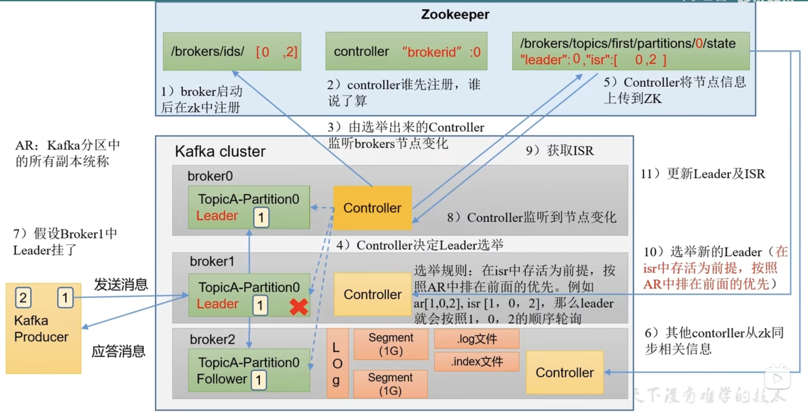
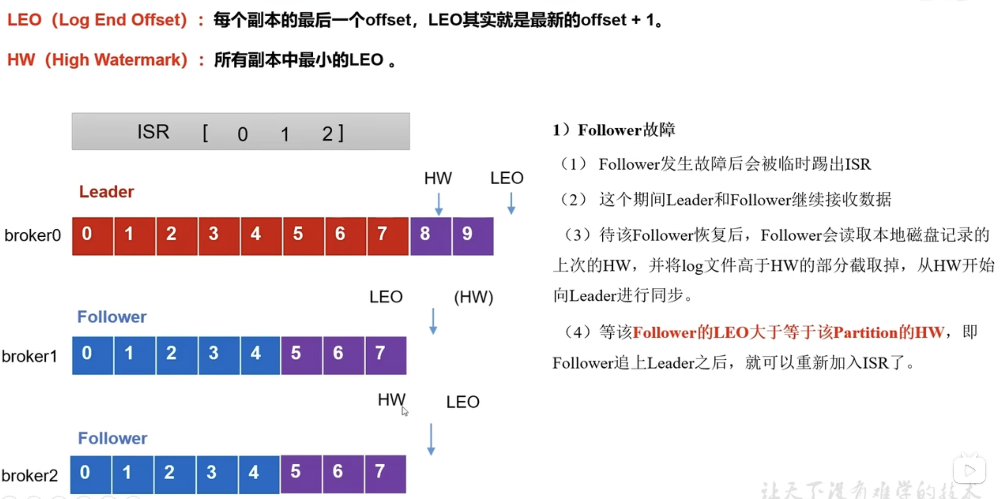
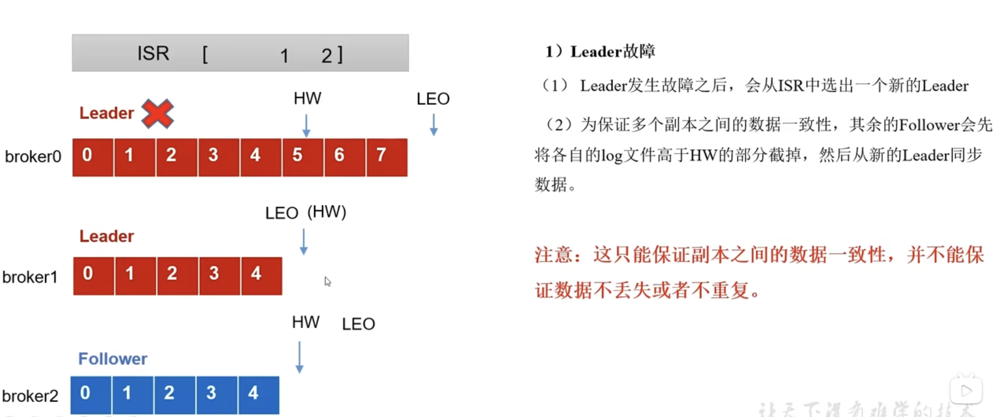
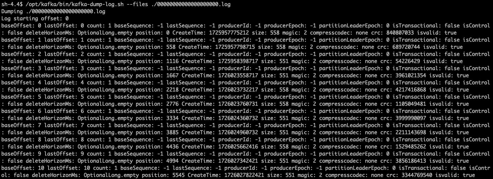
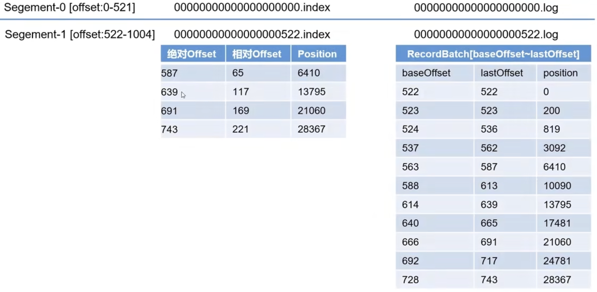
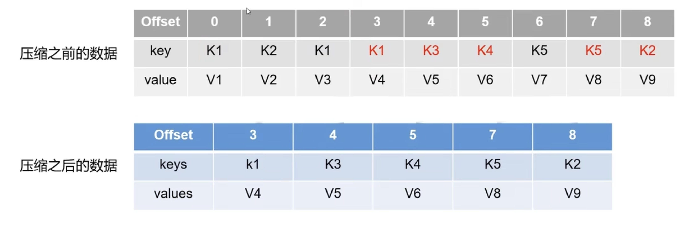
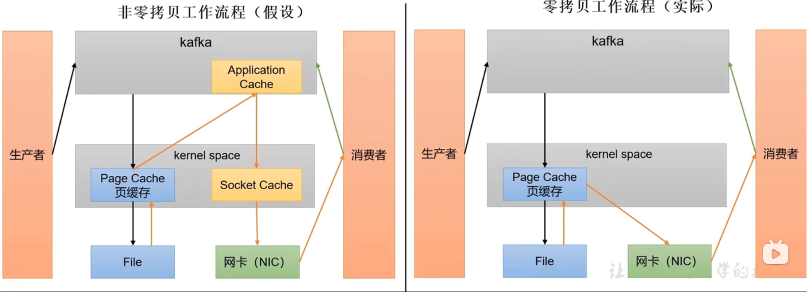

# Broker

## 工作流程

1. 每台kafka broker启动的时候都会注册到zk里面。
2. 每个broker上都有controller, 不同broker上的controller需要决定谁是leader, 一般谁先注册拿到锁谁就是leader.
3. 由选取出来的controller leade开始监听brokers节点的变化。
4. controller决定leader选举，选举规则为：在ISR存活的前提下，按照AR（所有副本的统称）排在前面的优先顺序选择。
5. 选举出leader以后，controller讲节点信息上传到zk上
6. 其他controller从zk同步相关的信息
7. producer开始发送信息，follower从leader里面同步数据，数据以log的形式进行存储，按照1G的容量划分成Segment，其中包含一个.index文件和.log文件，便于快速查找数据。数据接受完了以后会发个应答。
8. 当当前的leader挂了的时候，存活的controller就能监听到节点变化
9. 并且从zk里面获取ISR
10. 然后进行新的leader的选举
11. 然后更新leader的信息到zk

## 副本
1. 副本的作用：提高数据的可靠性
2. 默认副本为1，生产环境一般配置2个。太多副本会增加磁盘存储空间，增加网络传输负担，降低效率。
3. 副本有leader和follower。数据只会发给leader, 然后follower找leader同步数据
4. Kafka分区所有副本统称为AR（Assigned Replicas）

AR = ISR + OSR
- ISR(On-Sync Replicas): 表示和Leader保持同步的**Follower集合**。`replica.lag.time.max.ms`可以设置ISR时间，默认为30s,超过这个时间，follower会从ISR里面踢出去。
- OSR(Out-of-Sync Replicas): 表示Follower和Leader副本同步时，延迟过多的副本。

## 故障处理
2个概念:
1. LEO: Log End Offset: 每个副本的最后一个offset, LEO其实就是最新的offset + 1
2. HW: High Watermark: 所有副本中最小的LEO（和木桶原理类似）

### Follower故障处理

处理流程：
1. 当其中一个follower挂了的时候，首先ISR里面会把这个follower踢出去。
2. 还在工作的follower和leader会继续工作接受数据，对应的LEO和HW也会相应的发生变化
3. 等挂掉的follower恢复后，follower会先读取自己磁盘上的HW的记录，并把Log文件高于HW的部分删除掉，以防止数据未校验落盘，然后从HW开始的地方向leader进行同步，直到达到当前的高水位线的位置之后，把当前follower加入到ISR中。

### Leader故障处理

处理过程：
1. 当leader挂了，也是会先从ISR中把leader踢出去，并且需要选出新的leader
2. 为了保证数据一致性，每个follower会先把自己高于HW的部分截取掉，然后从新的leader同步数据

**问题**：
这种处理故障的方式只能保证数据的一致性，但不能保证数据不丢失或者不重复。

### leaderPartition的自动平衡

kafka本身会自动把Leader Partition均匀分散在各个机器上，来保证每台机器的读写吞吐量都是均匀的。但是如果某些broker宕机，会导致Leader Partition过于集中在其他少部分几台Broker上，这会导致少数几台Broker的读写请求压力过高，其他宕机的Broker重启之后都是follower partition，读写请求很低，造成集群负载不均衡。

`auto.leader.rebalance.enable`， 设置成`true`。自动进行leader partition平衡。
`leader.imbalance.per.broker.percentage`默认是10%，每个broker允许的不平衡leader的比率。如果超过这个值。controller会触发leader的平衡。
`leader.imbalance.check.interval.seconds`默认是300秒。检查Leader负载时候平衡的间隔时间。

## 文件存储

### kafka文件存储机制

Topics是逻辑上的概念，而partition是物理上的概念，每个partition对于与一个log文件，该log文件中存储的就是producer生产者的数据。Producer生产的数据会被不断的追加到该log文件的末端，为防止log文件过大导致数据定位效率低下。kafka采取了分片和索引的机制，将每个Partition分为多个segment.每个segment包括: index文件，.log文件和.timeindex等文件。这些文件位于一个文件夹下，命名规则为：topic名称+分区序号，例如：first-0.

log文件内容如下：

log文件和index文件详解

- 每个segment的大小都是1GB. 
- index为稀疏索引，大约每往log文件写入4Kb数据，会增加一条索引。参数`log.index.interval.bytes`默认为4kb
- index文件中保存的offset为**相对**offset,这样能确保offset的值所占的空间不会过大，因此能将offset的值控制在固定的大小

### Kafka文件清楚

- `log.retention.hours`, 最低优先级小时，默认为7天

日志处理策略有两种：`delete`和`compact`两种。

1. delete日志删除

- `log.cleanup.policy=delete` 所有的数据启用删除策略
  - 基于时间：默认打开。以segment中所有记录中的**最大时间戳作为该文件时间戳**。比如一个segment中的一部分数据过期了，一部分没有，怎需要等所有的数据都过期了以后才能删除。
  - 基于大小：默认关闭。超过设置的大小，删除最早的segment. `log.retention.bytes`默认为-1，表示无穷大，不会限制大小

2. compact日志压缩
- `log.cleanup.policy=compact` 所有数据启用压缩策略

相同的key只保留最新的数据

压缩完的Offset可能是不连续的，当从这些offset消费消息的时候，将会拿到比这个offset大的offset对应的消息。

这种策略只适合特点场景，比如消息的key是用户ID，value是用户资料，通过这种压缩策略，整个消息集里就保存了所有用户的最新资料。

## 高效数据读取
1. 本身是分布式集群，可以采用分区技术，并行度高
2. 数据采用稀疏索引，可以快速定位要消费的数据
3. 顺序写磁盘，写的过程是一直追加到文件的末端
4. 页缓存和零拷贝技术
   
   零拷贝: Kafka的数据加工处理操作由kafka生产者和kafka消费者处理。Broker应用层不用关心存储的数据，所以就不用走应用层，传输效率高。
   
   PageCache: 页缓存。当上层有写操作的时候，操作系统只是将数据写入PageCache。当读操作发生时，先从PageCache中查找，如果找不到，再去磁盘中读取。实际上PageCache是尽可能多的空闲内存都当作了磁盘缓存来使用。

   