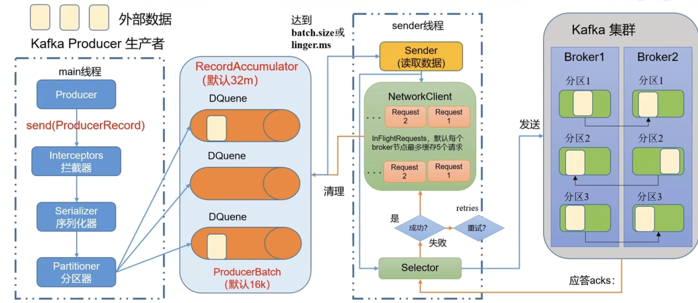

## Kafka生产者

### 原理

工作流程大致如下：
1. 首先在main线程中创建了一个Producer对象
2. 调用send方法来发送数据
3. 发送数据过程中，根据生产环境的需求来决定是否需要拦截器，可选项。
4. 通过序列化器对数据进行序列化，一般都是使用Build-in的序列化器进行序列化
5. 当数据发往不同的分区前，需要分区器来决定数据应该发送到哪些分区。
6. 数据会先发送到一个缓冲队列中，缓冲队列的默认大小是32Mb,每批次的大小是16KB
7. sender线程会主动拉取数据。
8. 拉取数据需要满足两个条件。
   1. `batch.size`：只有数据积累到`batch.size`之后，sender才会发送数据，默认大小为16K; 
   2. `linger.ms`：如果数据没有达到`batch.size`,sender等待`linger.ms`设置的时间到了以后就会发送数据，单位ms,默认值为0ms,表示没有延迟。
9.  发送数据的时候，队列里面的数据以节点的方式进行数据发送。发送过去之后，如果kafka集群没有及时应答，NetworkClient里面最多可以缓存5个请求。
10. 数据通过Selector发送到集群，集群开始做副本同步。同步完成后进行应答，应答的策略有三种。
    1.  0: 生产者发送过来的数据，不需要等数据落盘应答。
    2.  1: 生产者发送过来的数据，Leader收到数据后应答。
    3.  -1(all): 生产者发送过来的数据，Leader和ISR队列里面的所有节点收齐数据以后应答。
11. 应答如果成功，则会会请求删除，并且把队列里数据删掉。如果应答失败，有重试机制，默认的重试测试为Int的最大值，直到成功为止。

### 异步发送和回调异步发送
回调函数会在producer收到ack时调用，为异步调用，有两个参数，分别是元数据信息和异常信息，如果Exception为null,说明消息发送成功，否则，说明消息发送失败。
### 同步发送
和异步发送的区别是，必须等数据发送完毕后，就等待消息队列里面的数据发送结束，才会发新的数据到消息队列中。
### 分区
分区器的好处：
- 便于合理使用存储资源，每个partition在一个Broker上存储，可以把海量的数据按照分区切割成一块一块数据存储在多台broker上。合理控制分区的任务，可以实现负载均衡的效果。
- 提高并行度，生产者可以以分区为单位发送数据；消费者可以以分区为单位进行数据消费
### 分区策略
- 默认的分区器DefaultPartitioner
  - 如果指定了分区，就使用指定的这个分区
  - 如果没有指定分区，但设置了key,通过对key的hash值对设置的分区数进行取余得到分区
  - 如果既没有指定分区，也没有Key,则按照粘滞的方式(sticky partition)获取分区，直到当前批次的数据满了